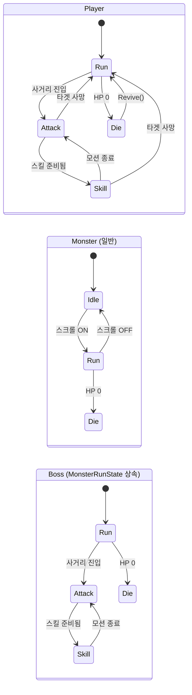
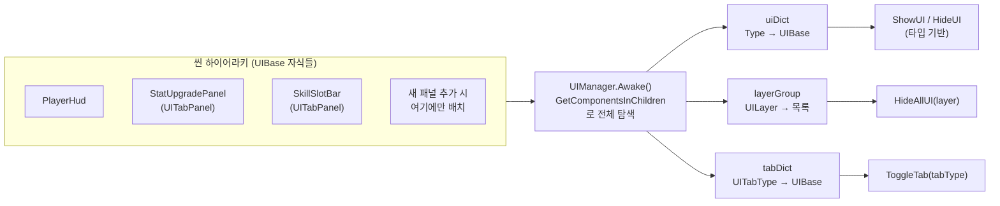
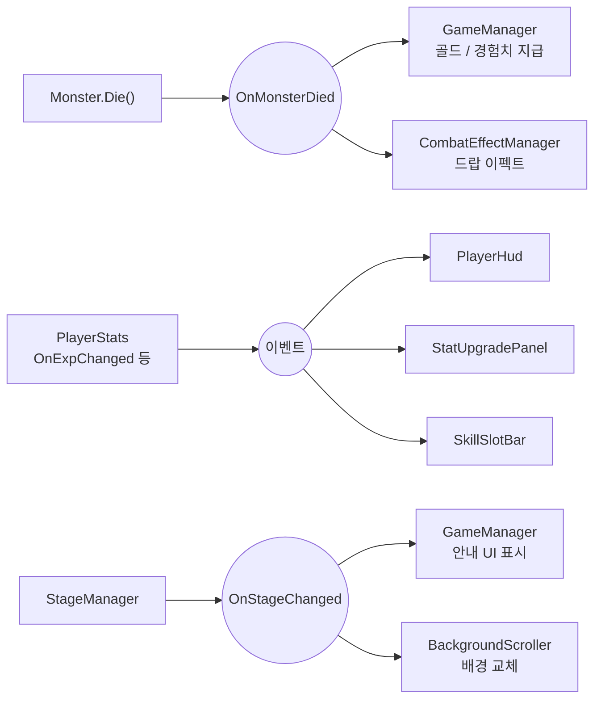
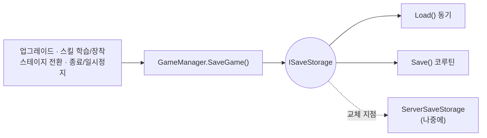

# 2D 방치형 게임

데이터 기반 설계로 만든 2D 방치형 액션 RPG 프로토타입입니다.

- 엔진: Unity 6000.4.9f1 (Unity 6)
- 개발 기간: 2026.06 ~ 진행 중

## 직접 플레이
https://answk427.itch.io/unityidlegame

## 목차

- [플레이영상](#플레이영상)
- [핵심 설계](#핵심-설계)
- [핵심 게임플레이](#핵심-게임플레이)
- [아키텍처](#아키텍처)
- [트러블슈팅](#트러블슈팅)
- [프로젝트 구조](#프로젝트-구조)

## 플레이영상

### 전체 게임 흐름
<video src="https://github.com/user-attachments/assets/57aa869b-a915-4c2d-8710-8e1918ef657a" width="100%" controls></video>
> 플레이어가 계속 이동 -> 마주치는 적과 전투 -> 보스 처치 후 다음 스테이지

### 사망 시 재시작
<video src="https://github.com/user-attachments/assets/12351cfa-88f5-491b-9cdf-7cd9a5ca42fc" width="100%" controls></video>
> 실패한 스테이지를 반복

### 스탯 업그레이드
<video src="https://github.com/user-attachments/assets/3f65d934-b512-4791-ba4c-0366af8dd589" width="100%" controls></video>
> 골드를 소모해 스탯 업그레이드

## 핵심 설계

1. **엑셀 → JSON → ScriptableObject 데이터 파이프라인을 설계 / 변환 툴 구현**: 기획자가 엑셀만 수정해도 게임 데이터가 자동 반영되고, 프리팹/텍스처 등 외부 참조는 이름 기반으로 자동 매칭하며, 수동으로 연결한 아이콘/VFX 참조는 재동기화해도 보존됩니다.
2. **인터페이스 기반 확장 구조**: 데이터 타입(`IData`)과 동기화기(`IDataSyncer`)는 리플렉션으로 자동 탐색되어 새 데이터 테이블을 추가해도 변환기 코드를 건드리지 않고, 스탯(`IUpgradeStat`)·스킬 효과(`ISkillBehavior`)도 구현 클래스 하나만 추가하면 확장됩니다.
3. **컴포넌트 자동 등록 기반 UI 프레임워크**: `UIManager`가 하위의 모든 `UIBase` 패널을 타입별로 자동 탐색·등록해서, 새 화면을 추가해도 `UIManager` 코드는 건드리지 않습니다. 레이어(`UILayer`)로 일괄 표시/숨김을, 탭(`UITabPanel`)으로 UI 전환을 관리합니다.
4. **이벤트·인터페이스로 일관되게 낮춘 결합도**: 전투 보상, UI 갱신, 스테이지·배경 전환까지 — 한 시스템은 "무슨 일이 일어났는지"만 흘려보내고 처리는 각 구독자가 맡는 구조를 프로젝트 전반에 동일하게 적용했습니다. 구체 타입 의존이 필요한 곳도 `IDamageable` / `IHasHp` 같은 인터페이스로 추상화해 플레이어와 몬스터를 같은 코드로 다룹니다.
5. **하나의 FSM 코어로 전체 엔티티 행동을 제어**: `IState` / `StateMachine`라는 작은 계약 하나로 플레이어·몬스터·보스의 이동·전투·사망을 전부 처리합니다. 엔티티마다 독립된 `StateMachine` 인스턴스를 가지며, 보스는 `BossRunState : MonsterRunState`처럼 기존 상태를 상속해 이동 로직은 재사용하고 고유 행동만 추가합니다.

## 핵심 게임플레이

- 캐릭터가 앞으로 계속 전진 -> 몬스터를 만나면 전투를 무한 반복
- 몬스터 무리를 일정 횟수 클리어하면 보스 도전 버튼이 열리고, 보스를 처치하면 다음 스테이지로 전환
- 레벨업 및 체력 / 공격력 / 공격속도 등 골드를 소모하여 스탯 업그레이드
- 스킬 학습 → 슬롯 배치 → 쿨다운 기반 자동 사용 (피해 / 광역피해 / 회복 타입)
- 골드·상자 드랍, 데미지·힐 텍스트, 히트 파티클 등 전투 피드백

## 아키텍처

### 1. 데이터 파이프라인: Excel → JSON/ScriptableObject
<video src="https://github.com/user-attachments/assets/86fc8e3e-2afe-4501-b435-67a08636b12a" width="100%" controls></video>
> 엑셀 시트 기준 변환, IData를 상속한 클래스로 변환 가능

```
기획자가 작성한 .xlsx
        │  ExcelToJsonConverter (Editor 전용 윈도우, ExcelDataReader로 파싱)
        │  - IData 구현 클래스를 리플렉션으로 자동 탐색
        │  - 엑셀 헤더 ↔ 클래스 필드를 매칭, 불일치 시 변환 자체를 중단
        ▼
Resources/Data/*.json (Newtonsoft.Json으로 직렬화)
        │  IDataSyncer 구현체를 리플렉션으로 자동 탐색해 타입별로 디스패치
        │  (Monster / Skill / Stage / PlayerStat 전용 Syncer)
        ▼
ScriptableObject 데이터베이스 (Assets/Data/**/*.asset)
        │  프리팹·텍스처는 이름 기반 자동 매칭
        │  아이콘·VFX·SFX 등 수동 연결 참조는 재동기화해도 보존
        ▼
GameDatabaseManager → 런타임 게임 로직
```

새로운 데이터 테이블을 추가해도 변환기 본체 코드는 수정하지 않고, `IDataSyncer` 구현 클래스 하나만 추가하면 자동으로 인식됩니다.
([ExcelToJsonConverter.cs](Assets/Editor/DataImporter/ExcelToJsonConverter.cs), [IDataSyncer.cs](Assets/Editor/DataImporter/IDataSyncer.cs))

---

### 2. 전투 FSM


> 셋 다 같은 `IState` 계약(Enter/Execute/Exit)을 쓰지만 전이 트리거는 다릅니다 — 스크롤 on/off는 이벤트 구독, 사거리 진입은 매 프레임 검사.

`IState`(Enter / Execute / Exit 메서드)와 `StateMachine`만으로 플레이어·일반 몬스터·보스의 이동·전투·사망을 전부 같은 방식으로 제어합니다. 엔티티마다 자신만의 `StateMachine` 인스턴스를 가져서, 화면에 몬스터가 여러 마리 있어도 서로 간섭 없이 독립적으로 동작합니다. 전이 방식도 상황에 맞게 나누는데, 스크롤 on/off 같은 전역 흐름 변화는 `GlobalGameEvents` 구독으로 반응하고(Idle ↔ Run), 사거리 진입처럼 매 프레임 바뀌는 조건은 `Execute()`에서 직접 검사합니다(Run → Attack). 보스는 `BossRunState : MonsterRunState`로 기존 이동 로직을 상속해 재사용하면서 공격 사거리 판정만 추가하고, 전투 상태는 `PlayerCombatState` / `BossCombatState` 추상 클래스가 쿨타임 계산과 타격 처리를 메서드로 공유합니다.

([StateMachine.cs](Assets/Scripts/FSM/StateMachine.cs), [PlayerCombatState.cs](Assets/Scripts/FSM/Player/PlayerCombatState.cs), [BossCombatState.cs](Assets/Scripts/FSM/Monster/BossCombatState.cs))

---

### 3. UI 프레임워크


> 새 패널을 씬에 배치만 하면 `UIManager`가 알아서 찾아서 등록 — 등록 코드를 따로 안 써도 됨.

모든 화면을 `UIBase`(일반 패널) 또는 `UITabPanel`(`UIBase` + 탭 연동 정보)로 표준화하고, `UIManager.Awake()`에서 `GetComponentsInChildren<UIBase>()`로 하위 패널을 한 번에 탐색해 타입을 키로 등록합니다. 새 패널을 추가할 때 `UIManager`에는 등록 코드를 추가하지 않고, 해당 컴포넌트가 붙은 오브젝트만 하이어라키에 배치하면 됩니다. `ShowUI<T>()` / `HideUI<T>()`로 타입 기반 제네릭 호출이 가능하고, `UILayer`(Static/Dynamic/Top)로 레이어 단위 일괄 제어를, `UITabType`으로 탭 간 배타적 전환(같은 탭 재클릭 시 닫힘)을 관리합니다.

([UIBase.cs](Assets/Scripts/UI/UIBase.cs), [UIManager.cs](Assets/Scripts/Manager/UIManager.cs))

---

### 4. 스킬 시스템 (Strategy Pattern)

<video src="https://github.com/user-attachments/assets/767b076e-f7cc-4e4f-8195-f6aa5fb51c03" width="100%" controls></video>
> 스킬 배치 -> 배치된 스킬 자동 사용

스킬의 실제 동작(`ISkillBehavior`)은 코드가 아니라 데이터(`SkillData.effectType`)로 결정되므로, 같은 효과 타입의 새 스킬을 추가할 때는 수치(`value1` / `value2`), (EffectFX / SoundFX)등만 다른 데이터로 추가하고 코드는 건드리지 않습니다. `Skill` 클래스가 쿨다운 계산과 실행을 함께 감싸서, FSM(`PlayerSkillState`/`BossSkillState`)는 스킬이 피해 · 광역 · 회복 중 무엇인지 몰라도 `IsReady` / `Use()` 만으로 동일하게 다룹니다. 캐스터 쪽도 `ISkillCaster` 인터페이스로 추상화해서, 플레이어와 보스가 같은 스킬 실행 코드를 공유합니다 — 보스도 쿨다운이 차면 일반 공격 대신 스킬을 자동으로 씁니다.

([Skill.cs](Assets/Scripts/Skill/Skill.cs), [ISkillBehavior.cs](Assets/Scripts/Skill/ISkillBehavior.cs))

---

### 5. 이벤트·인터페이스 기반 결합도 분리


> 발행자 하나가 구독자 여러 명에게 동시에 영향을 주지만, 발행자는 구독자가 누군지 전혀 모릅니다.

`GlobalGameEvents`(스테이지 전환, 스크롤 상태 등 흐름)와 `GlobalCombatEvents`(피격, 사망, 회복 등 전투)로 정적 이벤트를 분리했습니다. 몬스터(`Monster.Die()`)는 죽었다는 사실과 보상치만 흘려보내고, 실제 골드/경험치 지급(`GameManager`)과 드랍 이펙트(`CombatEffectManager`)는 각자의 구독자가 처리합니다. 같은 원칙이 UI에도 쓰여서 `PlayerStats`가 `OnExpChanged` / `OnLevelUp` / `OnUpgraded` 등을 흘려보내면 `PlayerHud` · `StatUpgradePanel` · `SkillSlotBar`가 각자 구독해서 갱신하고, 스테이지가 바뀌면(`OnStageChanged`) 안내 UI와 `BackgroundScroller`가 서로의 존재를 모른 채 독립적으로 반응합니다. 구체 타입 의존이 필요한 곳은 `IDamageable` / `IHasHp` 인터페이스로 추상화해 플레이어와 몬스터를 동일한 코드로 처리합니다.

([GlobalCombatEvents.cs](Assets/Scripts/Event/GlobalCombatEvents.cs), [GlobalGameEvents.cs](Assets/Scripts/Event/GlobalGameEvents.cs), [PlayerStats.cs](Assets/Scripts/Player/PlayerStats.cs), [BackgroundScroller.cs](Assets/Scripts/Texture/BackgroundScroller.cs))

---

### 6. 오브젝트 풀링

몬스터, 데미지 텍스트, 히트 파티클, 보상 드랍 이펙트를 모두 `PoolManager`가 Unity 내장 `ObjectPool<GameObject>`로 관리합니다. 스테이지 전환 시 해당 프리팹의 풀만 선택적으로 비우는 방식으로 메모리를 관리합니다.

([PoolManager.cs](Assets/Scripts/Manager/PoolManager.cs))

---

### 7. 저장 시스템


> 주기적 자동저장은 없고 이 4개 이벤트에서만 저장합니다. `Load()`는 결과가 즉시 필요해서 동기, `Save()`는 호출부가 안 기다려도 돼서 코루틴 — 종료/일시정지처럼 다음 프레임을 보장 못 받는 시점만 그 코루틴을 동기적으로 끝까지 돌려서 저장을 보장합니다. 백엔드 교체는 `ISaveStorage` 구현체 하나 + 진입점 한 줄.

### 추후 고려사항
- 서버 저장으로 전환할 경우 종료 직전(`OnApplicationQuit`) 동기 저장 로직은 응답을 기다리지 못하고 끊길 수 있어, 그 시점엔 별도 보장 전략이 필요합니다.

([ISaveStorage.cs](Assets/Scripts/Player/ISaveStorage.cs), [LocalFileSaveStorage.cs](Assets/Scripts/Player/LocalFileSaveStorage.cs), [GameManager.cs](Assets/Scripts/Manager/GameManager.cs))

---

## 트러블슈팅

### 충돌/이펙트 위치 보정


> PIVOT 중심거리만으로 사거리를 재면 덩치가 다른 캐릭터의 판정이 부정확합니다. SpriteRenderer/Collider2D 바운드의 중심·폭을 계산해서 자동으로 보정하려 했지만, 바운드가 캐릭터 실루엣보다 크게 잡히거나 애니메이션 프레임마다 달라져서 자동 계산 자체가 불안정했습니다. 그래서 디자이너가 직접 값을 넣는 `halfWidthOverride`로 바꿨고, 이펙트 위치 보정(`hitPositionOffset`)도 같은 이유로 같은 방식을 택했습니다.

([CombatRangeUtility.cs](Assets/Scripts/CombatRangeUtility.cs), [HitboxProfile.cs](Assets/Scripts/HitboxProfile.cs), [IDamageable.cs](Assets/Scripts/UI/IDamageable.cs))

---


## 프로젝트 구조

```
Assets/
├─ Scripts/
│  ├─ Data/         # IData 구현체 + ScriptableObject 데이터베이스 정의
│  ├─ Manager/       # GameManager, StageManager, PoolManager, UIManager 등 매니저
│  ├─ FSM/           # 상태머신 + Player/Monster 상태 클래스
│  ├─ Skill/         # 전략 패턴 기반 스킬 효과
│  ├─ Player/        # 스탯 / 저장데이터 / 업그레이드
│  ├─ UI/            # UIBase 계층 + 화면별 컴포넌트
│  └─ Event/         # 전역 이벤트 버스
├─ Editor/DataImporter/  # Excel → JSON → ScriptableObject 변환 툴
├─ Data/                 # 데이터베이스 ScriptableObject 에셋
├─ Resources/             # 런타임 로드 프리팹 / JSON
└─ Tests/EditMode/        # 스탯/업그레이드/스킬 쿨다운 등 핵심 도메인 로직 단위 테스트
```
